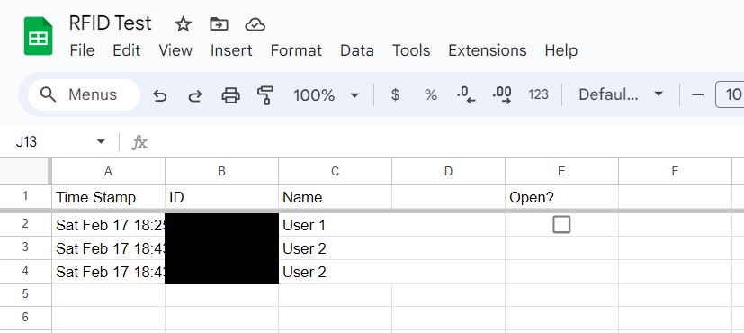

# RFID-Solenoid-Lock

RFID access control for shared makerspace lockers. A Raspberry Pi 3 reads keycards with an RC522 reader, drives a solenoid lock through a relay when the card is on the allow list, and logs each scan (time, card ID, card text) to a Google Sheet so staff have an access history.

## Hardware
- Raspberry Pi 3
- RC522 RFID reader (SPI)
- Relay module on GPIO 18 driving a solenoid lock

## Setup
1. Create a Google Cloud project, enable the Sheets API, and download an OAuth client JSON as `client_secret.json` (it's gitignored — don't commit it).
2. Set `spreadsheet_id` and add allowed card IDs to `valid_ids` in `rfid_relay_test.py`.
3. `pip install mfrc522 google-api-python-client google-auth-oauthlib`
4. `python3 rfid_relay_test.py`

`Google.py` is a Sheets API helper by [Jie Jenn](https://www.youtube.com/@jiejenn).

## Known limitations
- Timestamp is captured once at startup; it should be taken per scan.
- The remote-unlock checkbox (cell E2) works for anyone who can edit the sheet.
- A network error while logging stops the script.
- Solenoids are rated for intermittent duty — holding one energized for long periods will overheat it.
